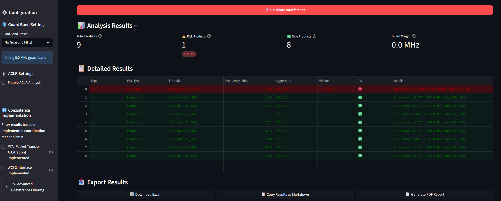
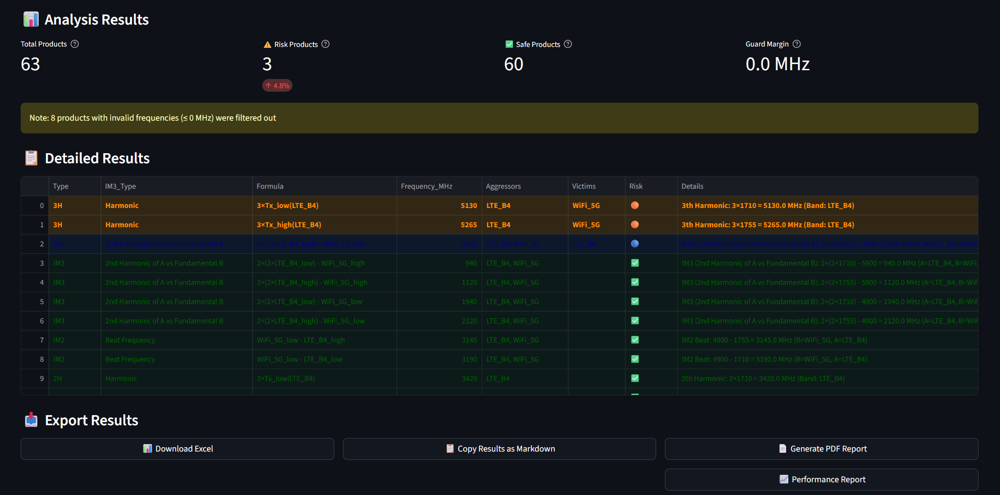
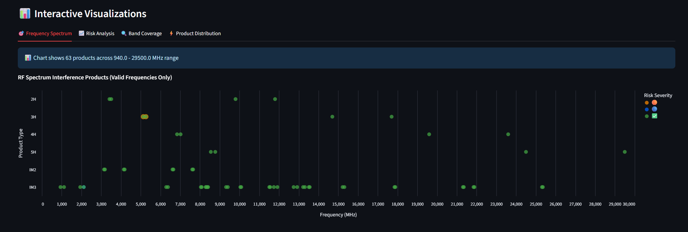
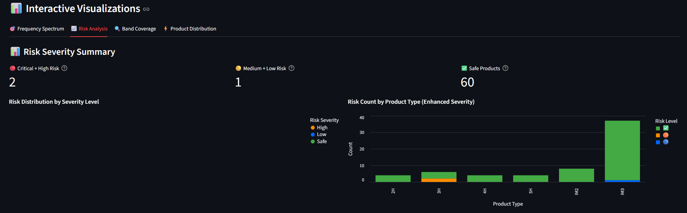
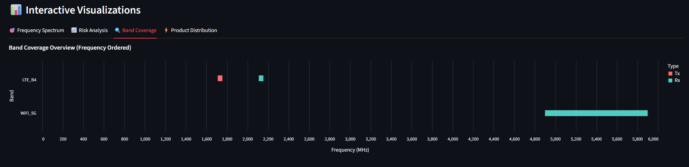
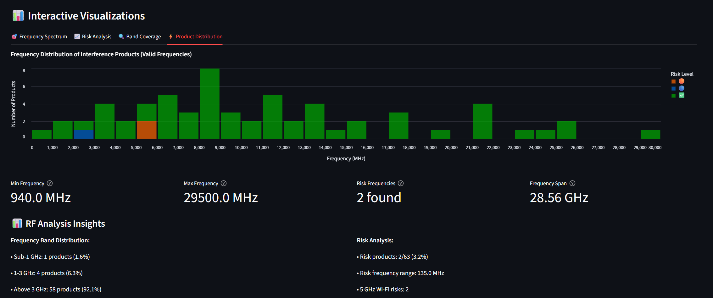
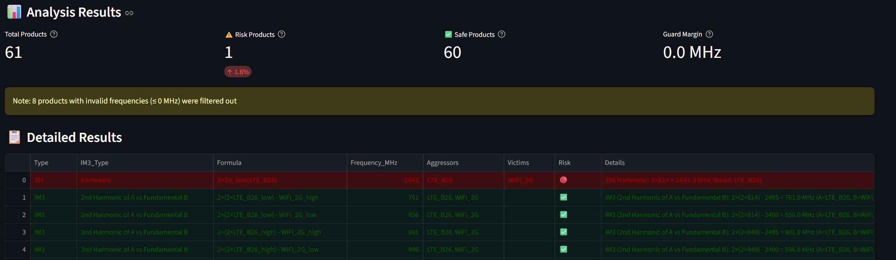

<p align="center">
  
</p>

<h1 align="center">RF Spectrum Interference Calculator</h1>

<p align="center">
  <strong>Professional RF tool for analyzing interference, harmonics, and intermodulation products</strong>
</p>

<p align="center">
  <a href="https://github.com/RFingAdam/rf-interference-calculator/actions/workflows/test.yml"></a>
  
  
  
  
  
</p>

---

A professional RF engineering tool for analyzing interference, harmonics, and intermodulation products across 85 wireless bands -- including 5G NR FR1 -- with comprehensive RF system performance analysis, unified risk assessment, and Monte Carlo simulation.

## What's New in v2.2.0

- **Technology-dependent risk thresholds**: GNSS, WiFi/BLE, LoRa, and LTE/NR each have appropriate desensitization sensitivity levels
- **Receiver blocking analysis**: 5-tier blocking risk assessment with configurable RX P1dB parameter
- **3-tone IMD products**: Triple-beat intermodulation from 3 simultaneous transmitters
- **Phase noise model**: LO phase noise contribution to interference, critical for GNSS analysis
- **Physics-based RF models**: Frequency-dependent TX filters, coupling factors, and PAPR-dependent harmonics
- **Robust Monte Carlo**: Truncated distributions, temperature coefficients, and bounded sampling
- **pytest framework**: 174 tests with GitHub Actions CI on Python 3.10/3.11/3.12
- **Named RF constants**: PA class corrections, harmonic limits, and filter parameters with source references
- **14 bug fixes**: IMD saturation clamp, GNSS sensitivity, harmonic isolation floor, bandwidth normalization, and more

See [CHANGELOG.md](CHANGELOG.md) for the full history of changes.

## Key Features

- **85 Wireless Bands**: 2G GSM, 3G UMTS, LTE (31 bands), 5G NR FR1 (14 bands), Wi-Fi 2.4/5/6E, BLE, GNSS, ISM, IoT, LoRa, HaLow, RFID, Public Safety, and Amateur bands
- **Complete IMD Analysis**: IM2, IM3, IM4, IM5, IM7 intermodulation products plus Harmonics 2H through 5H
- **RF Performance Analysis**: Real signal levels (dBm), desensitization margins, and performance impact using industry-standard formulas
- **Unified Risk Assessment**: Combined frequency-based and power-based severity analysis with color-coded alerts
- **Monte Carlo Simulation**: Worst-case analysis with P50/P95/P99 percentiles across TX power, IIP3, isolation, and coupling tolerances
- **Regulatory Compliance**: 3GPP TS 36.101 / TS 38.101 and FCC spurious emission checks with bandwidth normalization
- **34 Isolation Pairs**: Per-band isolation requirements matrix covering critical GNSS, WiFi, and NR coexistence scenarios
- **Interactive Charts**: Frequency spectrum, risk analysis, band coverage, and product distribution visualizations
- **Professional Export**: CSV, Excel, JSON with timestamps and quantitative columns

## Professional Use Cases

- **RF System Design**: Predict interference performance before hardware development
- **Pre-hardware Validation**: Validate coexistence with quantitative signal-level analysis
- **Regulatory Analysis**: Generate interference studies with 3GPP/FCC compliance checking
- **Design Optimization**: Engineering recommendations for isolation, filtering, and layout
- **Engineering Training**: Standard RF calculations with professional methodology

## For Engineers

### Interpreting Results
- **Desensitization (dB)**: Increase in effective noise floor from interference. 1 dB is noticeable, 3 dB halves range, >6 dB is significant.
- **Blocking risk**: Separate from desensitization. A strong signal can cause blocking without being in-band.
- **Risk thresholds vary by technology**: GNSS is flagged critical at 8 dB, while LTE tolerates 12 dB before critical.
- **Monte Carlo p95**: The 95th percentile represents worst-case across manufacturing tolerances and temperature.

### Recommended Workflow
1. Start with frequency-only analysis to identify which products land in victim bands
2. Enable quantitative analysis with realistic system parameters
3. Run Monte Carlo (500+ iterations) for statistical confidence
4. Check regulatory compliance for products near emission limits
5. Use blocking analysis for strong out-of-band interferers

## Professional RF Performance Analysis

Transform frequency conflicts into actionable engineering data.

### Signal-Level Analysis
- **P_IM3 = 3 x P_in - 2 x IIP3** calculations using industry-standard formulas
- Real interference power levels at victim inputs (dBm)
- Performance margins vs sensitivity thresholds
- PER estimates for different modulation schemes
- Unified risk scoring combining frequency overlap and power severity

### System Parameter Configuration
Choose from professional presets or customize all parameters:
- **Mobile Device**: 20 dB isolation, -12 dBm IIP3, 23 dBm LTE
- **IoT Gateway**: 35 dB isolation, -18 dBm IIP3, 20 dBm LTE
- **Automotive**: 25 dB isolation, -10 dBm IIP3, 27 dBm LTE

Configurable parameters include antenna isolation, IIP3/IIP2 linearity, coupling factor (0.0-1.0), and LTE-to-GNSS coupling loss.

### Enhanced Results

| Type | Freq | Aggressor to Victim | Power | Margin | Impact | PER |
|------|------|---------------------|-------|--------|--------|-----|
| IM3  | 2442 | LTE+BLE to WiFi     | -42 dBm | 8 dB  | Medium | 5%  |

### How to Access
1. Run standard interference analysis
2. Click "Performance Report" button
3. Configure system parameters
4. Click "Run Performance Analysis"
5. Get real signal levels and optimization recommendations

## Critical Interference Examples

### 1. GPS Safety Risk

**LTE Band 13** (777-787 MHz) **to GPS L1** (1575 MHz)
- **Product**: 2nd Harmonic at 1574 MHz -- Critical
- **Impact**: GPS navigation interference
- **Formula**: `2 x 787 MHz = 1574 MHz` (hits GPS L1 at 1575.42 MHz)

### 2. Wi-Fi 5G Performance Impact

**LTE Band 4** (1710-1755 MHz) **to Wi-Fi 5G** (5150-5925 MHz)
- **Product**: 3rd Harmonic at 5265 MHz -- High
- **Impact**: Wi-Fi channel blocking
- **Formula**: `3 x 1755 MHz = 5265 MHz` (hits Wi-Fi 5G channels)

#### Detailed Analysis Views

**Frequency Spectrum**: Interactive scatter plot showing interference products across frequency bands


**Risk Analysis**: Severity breakdown and critical product identification with color-coded alerts


**Band Coverage**: Visual frequency allocation showing transmit/receive band relationships


**Product Distribution**: Frequency histogram of all interference products with risk-based coloring

### 3. ISM Band Conflicts

**LTE Band 26** (814-849 MHz) **to Wi-Fi 2.4G/BLE** (2400-2500 MHz)
- **Product**: 3rd Harmonic at 2442 MHz -- Critical
- **Impact**: BLE and Wi-Fi 2.4G interference
- **Formula**: `3 x 814 MHz = 2442 MHz` (hits ISM band center)

> Complete screenshot documentation is available in [screenshots/README.md](screenshots/README.md) for detailed scenario explanations and configuration instructions.

## Quick Start

```bash
# Install dependencies
pip install streamlit pandas altair openpyxl plotly

# Run the application
streamlit run ui.py
```

**Basic Usage:**
1. Select band categories and specific bands
2. Configure guard margins and analysis products
3. Click "Calculate Interference"
4. Review critical results and export data

**Performance Analysis Workflow:**
1. Complete basic interference analysis (above)
2. Click "Performance Report" button
3. Configure system parameters (presets available)
4. Click "Run Performance Analysis"
5. Get real signal levels, margins, and optimization recommendations

## Interactive Analysis Features

The application provides four comprehensive analysis views:

### Four Analysis Views
- **Frequency Spectrum**: Interactive scatter plot showing all interference products positioned by frequency and risk level
- **Risk Analysis**: Pie chart showing severity distribution with color-coded risk categories and critical product counts
- **Band Coverage**: Visual frequency allocation chart displaying transmit/receive band relationships and overlaps
- **Product Distribution**: Histogram showing frequency distribution of interference products with risk-based coloring

Each view provides different insights:
- **Spectrum view**: Identifies exact interference frequencies and victim bands
- **Risk view**: Prioritizes critical products requiring immediate attention
- **Coverage view**: Shows band relationships and potential conflicts
- **Distribution view**: Reveals interference concentration across frequency ranges

## Project Architecture

```
rf-interference-calculator/
  ui.py                  # Streamlit web application
  calculator.py          # Core interference calculations and unified risk assessment
  rf_performance.py      # RF performance analysis and Monte Carlo simulation
  bands.py               # 85 wireless band definitions (2G through 5G NR)
  constants.py           # Centralized version, colors, risk styles, sort orders
  regulatory_limits.py   # 3GPP/FCC spurious emission database
  isolation_matrix.py    # 34 per-band isolation requirement pairs
  .streamlit/config.toml # Professional blue theme configuration
```

## Band Coverage Summary

| Category | Bands | Examples |
|----------|------:|---------|
| LTE | 31 | B1-B71 (FDD, TDD, SDL) |
| 5G NR FR1 | 14 | n1, n3, n41, n77, n78, n79 |
| 3G UMTS/WCDMA | 6 | B1-B8 |
| 2G GSM | 3 | 850, 1800, 1900 |
| Wi-Fi | 3 | 2.4G, 5G, 6E |
| HaLow | 6 | NA, EU, AUS, JP, TW, KR |
| ISM | 5 | 433, 450, 902, 2400, 5800 MHz |
| IoT | 3 | Zigbee, Thread, Matter |
| GNSS | 3 | L1/E1, L2, L5/E5 |
| Public Safety | 3 | TETRA, P25 VHF/UHF |
| Other | 8 | BLE, LoRa, RFID, Amateur |
| **Total** | **85** | |

## Versioning

Current version: **v2.2.0** -- Technology-dependent risk thresholds, blocking analysis, 3-tone IMD, phase noise model, and 174 tests.

Previous releases: [CHANGELOG.md](CHANGELOG.md)

## Authors

Adam Engelbrecht (RFingAdam)

## Limitations

This tool provides engineering estimates, not certification-grade predictions. Known limitations:

- **Modulation effects simplified**: PAPR model uses 30% correction factor; actual harmonic generation depends on signal statistics
- **Single-path coupling**: Each aggressor-victim pair uses one coupling path; real systems have multiple coupling mechanisms
- **No antenna pattern modeling**: Antenna gain patterns at harmonic frequencies are simplified to lookup adjustments
- **Linear phase noise model**: -20 dB/decade approximation; real oscillators have more complex noise profiles
- **2D isolation model**: Board-level coupling doesn't account for 3D enclosure effects or cable routing
- **No AGC modeling**: Receiver automatic gain control dynamics not simulated
- **Steady-state analysis**: Does not model transient interference from TDD switching or burst transmissions

Results should be validated against measurements for regulatory submissions.

## License

GNU Affero General Public License v3.0 (AGPL-3.0) -- Free for personal, educational, and commercial use with source sharing requirements.

## Brand assets

The project name and the logo files in this repository are not part of the licensed
work. The licence above grants no permission to use them, except as needed to describe
the origin of the work.
